
 </img>

# SportsMate

## 목차

* [프로젝트 개요](#프로젝트-개요)
* [프로젝트 소개 내용](#프로젝트-소개)
* [프로젝트 기술 스택](#프로젝트-기술-스택)
* [프로젝트 사용](#프로젝트-사용)
* [기대 효과](#기대-효과)
* [팀원 소개](#팀원-소개)

## 프로젝트 개요

팀 스포츠 활동을 하고자 모인 사람들이 장소 결제 및 대여를 편하게 할 수 있도록 도와주는 웹서비스

## 프로젝트 소개

최근 코로나 규제가 많이 풀리면서 많은 사람들이 다시 스포츠 활동을 즐기기 시작하고 있다. 조사 결과 다양한 스포츠 활동에 대해 장소 대여 및 결제를 동시에 지원해주는 웹서비스가 없다는 것을 확인하였다. 이에 팀 스포츠를 취미로 가진 사람들이 편하게 교류할 수 있도록 모임을 만들고 Toss API를 활용한 간편한 결제를 통해 쉽게 장소 대여를 하게 해주는 웹 서비스를 만들었다.

## 프로젝트 기술 스택

programming language : Java, Javascript

front : React

back : SpringBoot

security : SpringSecurity , JWT

db & orm : Spring Data JPA, Hibernate, mysql

api : tosspayments, kakao map api

devops : Git, Github, AWS EC2, AWS RDS, AWS S3, PWA

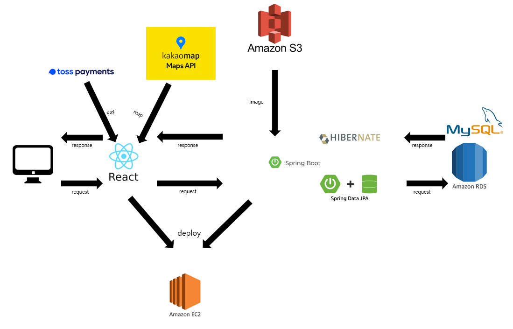

## 프로젝트 사용

#### 홈 화면
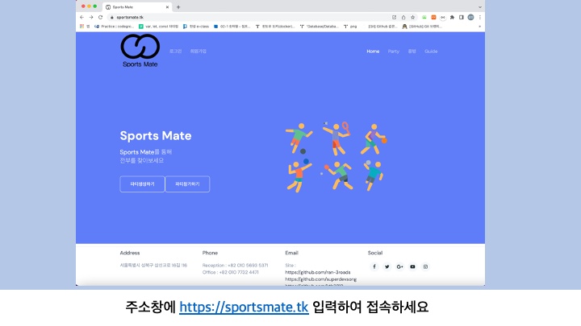
 

#### 로그인 화면
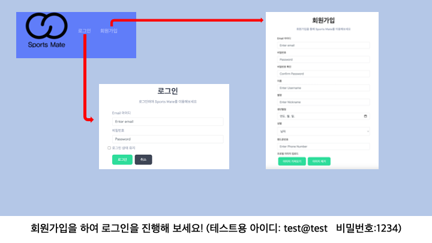
 

#### 파티 화면

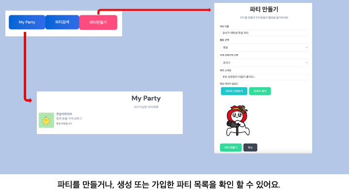
 
#### 게시판 화면
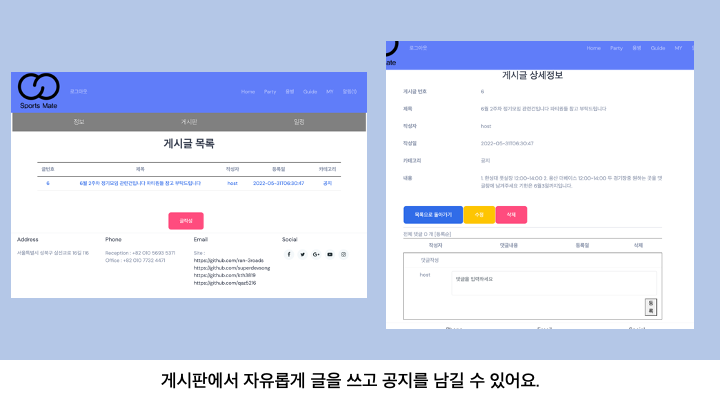

#### 스케쥴 화면
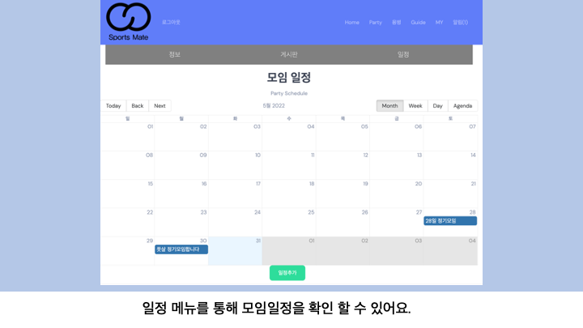

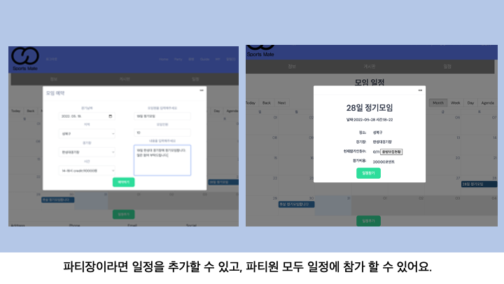

#### 용병 화면
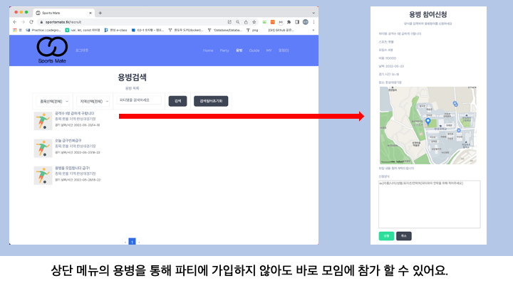

#### 내 정보 화면
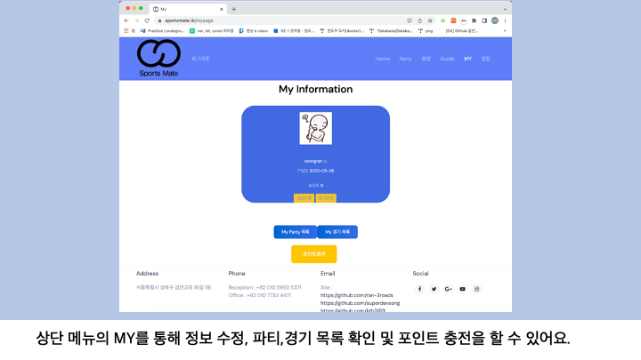
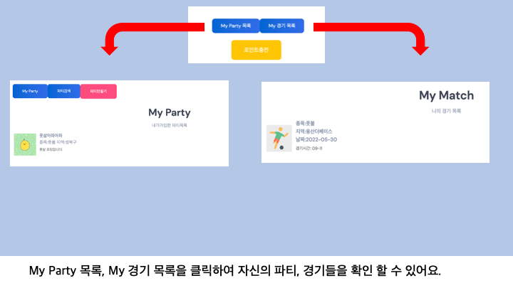

#### 포인트 충전 화면

#### 알림 화면
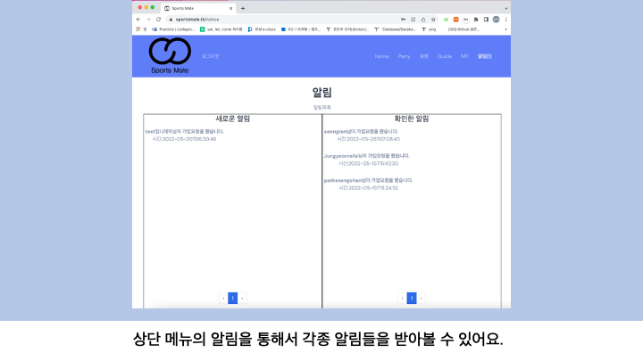

#### 모바일 화면
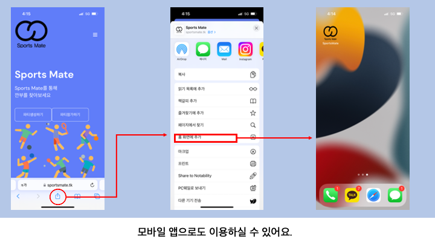

## 기대 효과

다른 운동 동호회와 소모임은 팀 스포츠를 중점으로 서비스를 제공하지 않는다. 때문에
평소에 팀 스포츠를 접하기 어려움을 느끼는 사람들이 많은데, 이러한 사람들이 팀 스포츠를 간편하고 쉽게 참여할 수 있도록 모임을 만들고 장소 결제 및 대여를 대신해서 앞서 말한 불편함을 해소하는 효과를 기대할 수 있다.

## 팀원 소개

###  :dolphin: 송영우 <a href="https://github.com/superdevsong"> github </a>

* JWT SpringSecurity를 활용한 로그인 구현
* Spring Data JPA를 활용하여 로그인 파티보드 댓글 용병 서비스 기능 구현
* 위에서 언급한 기능들 rest api 연동
* 토스 페이먼츠 api를 활용하여 결제 서비스 구현 
* AWS S3 연동하여 파일 업로드 구현
* AWS EC2에 back front 서버 배포 
* AWS RDS mysql로 db 구현 
* AWS Route 53을 활용하여 도메인 적용 

###  :dog: 박성찬 <a href="https://github.com/ran-3roads"> github </a>

* Spring Data JPA를 활용하여 파티 생성 및 관리, 스케쥴, 예약, 알림 서비스 기능 구현
* 위 기능들을 REST API 설계 및 연동
* DB Table 설계 및 Entity 개발
* KAKAO Map API를 활용하여 지도 서비스 구현
* Git hub Collaborative Workflow 도입 및 가이드
* 프로젝트에 PWA 환경 구축

###  :pig: 김태현 <a href="https://github.com/kth3819"> github </a>

* react라이브러리를 활용하여 파티 게시판, 용병 카테고리, My Page, 가이드 폼 구현
* next.js를 활용하여 페이지 라우팅
* 이미지 처리 함수 구현 및 다양한 페이지에서 활용 
* 회원가입, My Page, 용병, 파티(일정 제외) 페이지 axios를 활용하여 서버와 통신
* 서버에서 받은 에러코드 클라이언트 화면 처리 ex)경고문
* PWA를 고려한 UI 개선
* 각 페이지별 필요한 css 정리 

###  :sleepy: 박경민 <a href="https://github.com/qaz5216"> github </a>

* react라이브러리를 활용하여 홈화면,로그인,회원가입,파티 카테고리, 알림 카테고리, 파티관리, 용병모집 폼 구현
* next.js를 활용하여 페이지 라우팅
* next.js/image 라이브러리의 Image 태그 활용하여 img 태그 대체
* reactBigCalender 라이브러리를 이용하여 파티일정 구현
* React Modal을 이용한 일정추가 기능 구현.
* 로그인, 파티일정,파티보드 댓글,용병 모집폼, 파티 페이지,알림 axios를 활용하여 서버와 통신 및 예외처리
* fillter 를 이용한 파티검색 기능 구현
* PWA를 고려한 UI 개선
* 각 페이지별 필요한 css 정리 

